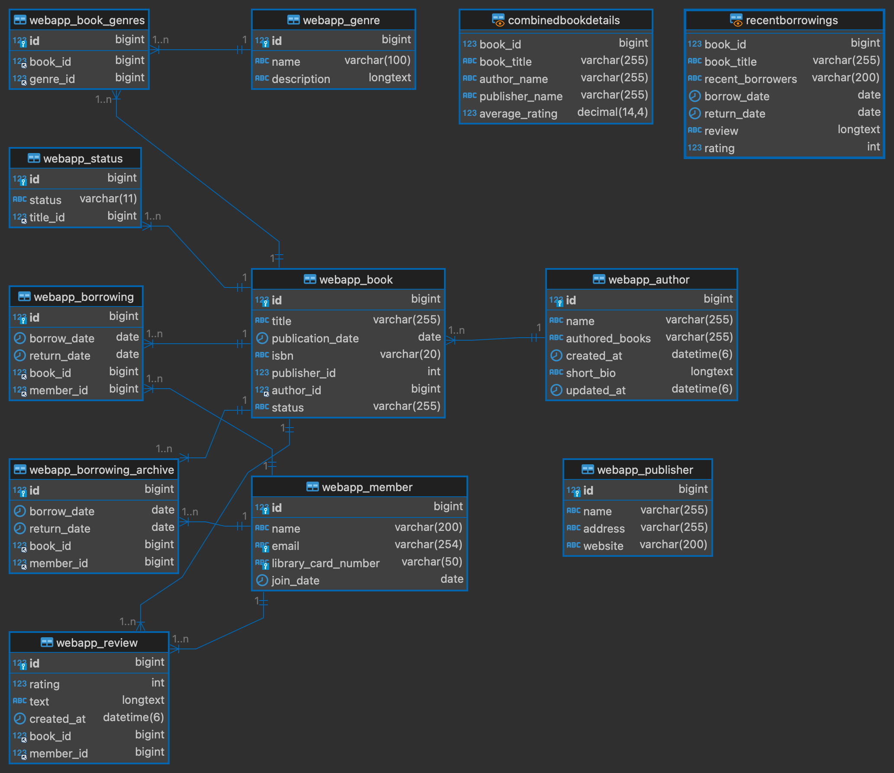

# OnlineLibraryDB
My final project for NYU's Database Principals class is an online library management system using a multi-tiered architecture based on Python's Django frontend framework. The backend is a MySQL Database.

With this application, an admin can:
1. Monitor and manage library books being checked out and returned
2. Generate reports on:
    1. Max number of books borrowed by a given user
    2. Obtain total number of books currently checked out
    3. The average borrowing duration of books
3. Perform CRUD operations on the following tables:
    1. Books
    2. Authors
    3. Members
    4. Borrowers
    5. Reviews
    6. Publishers
    7. Status
4. Glean useful aggregate information from two views:
    1. Combined Book List which combines data from:
        1. Books Table
        2. Authors Table
        3. Publishers Table
    2. Borrowers Reviews which combines information from:
        1. Books Table
        2. Borrowers Table
        3. Reviews Table 
5. Leverage two TRIGGERS:
    1. Check Borrower Limit:
        1. This trigger is activated before a new borrowing record is inserted into the borrowing table. 
        2. This trigger will check if the member has already borrowed more than a certain number of books within a specific timeframe. In this case 2 per week
    2. Update Borrower Status:
        1. Automatically updates the status of a book to 'Available' once it is returned, and 'Unavailable' once checked-out. 
        2. This ensures that as soon as a book is marked as returned in the borrowing log, its availability status is updated, allowing other members to borrow it.
6. Leverage two PROCEDURES:
    1. Mark Book as Returned:
        1. Involves updating specific fields in a database record (e.g., updating the return_date field for a borrowing record). 
        2. It takes parameters (such as the book ID and return date), checks any necessary conditions (e.g., that the book is currently checked out), updates the record, and handles any related tasks (such as adjusting inventory counts or updating member borrowing statuses). 
        3. This makes the process reusable and encapsulates the business logic in the database layer.
    2. Auto-Generate Library Card ID Upon Member Creation:
        1. Ensures user ids are syntactically and numerically consistent. Reusable and procedurally generated which prevents duplicate conflicts.
7. Leverage two FUNCTIONS:
    1. Get AVG Book Rating:
        1. Takes the average of all submitted user-ratings and integrates into the book_list and combined_book_information views.
        2. Calculates the average rating for a book based on all its reviews. 
        3. This function can be called whenever the developer needs to display the average rating somewhere, ensuring the logic for calculating the rating is consistent and maintained in one place.
    2. Calculates Total Books Borrowed:
        1. This function takes three parameters: 
            1. member_id - The ID of the member whose borrowing history is being queried
            2. start_date - The beginning of the date range for the query.
            3. end_date - The end of the date range for the query.
        2. And it returns an integer representing the total number of books borrowed by the specified member within the specified date range.

# Installation Steps
```
git clone git@github.com:klausware/OnlineLibraryDB.git
mysqladmin create OnlineLibraryDB
mysql OnlineLibraryDB < OnlineLibraryDB.sql
```

# Diagrams
## Updated ER Diagram


## Original ER Diagram


To restore, clone to
/Users/$USER/Documents/nyu/database-principals/project/library-management-frontend