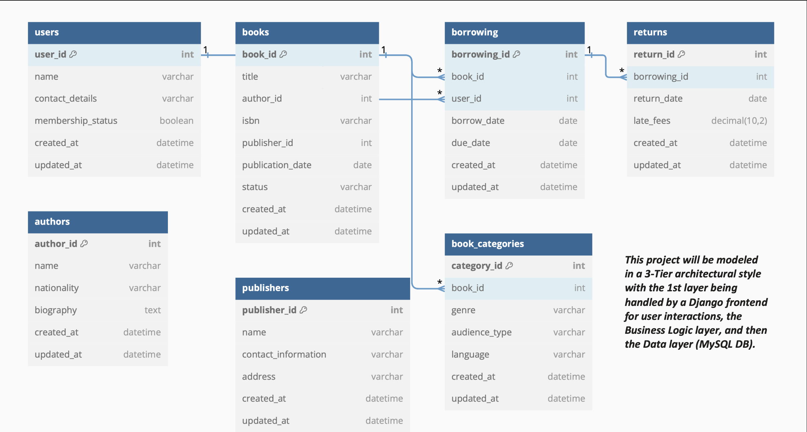

# OnlineLibraryDB
My final project for NYU's Database Principals class is an online library management system using a multi-tiered architecture based on Python's Django frontend framework. The backend is a MySQL Database.

With this application, an admin can:
1. Monitor and manage library books being checked out and returned
2. Generate reports on:
    1. Max number of books borrowed by a given user
    2. Obtain total number of books currently checked out
    3. The average borrowing duration of books
3. Perform CRUD operations on the following tables:
    1. a

# Diagrams
## Updated ER Diagram

## Original ER Diagram

To restore, clone to
/Users/$USER/Documents/nyu/database-principals/project/library-management-frontend